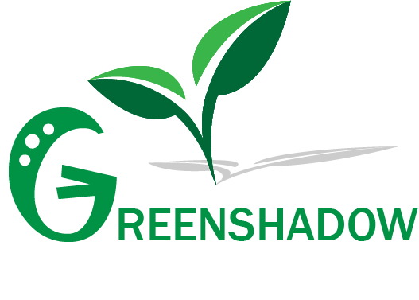

<div align="center">
  
<h2>GreenShadow-FRONTEND</h2>
</div>

### Introduction
This Web-base System developed for Green Shadow (Pvt) Ltd., a company specializing in root crops and cereals. As the company expands to large-scale production, this system helps manage crops and assets efficiently. The crop-monitoring-backend API supports real-time tracking of crop data and field conditions, enabling data-driven decision-making for optimized farming operations.

### Screenshots

Project UI screenshots are available [here](https://drive.google.com/drive/folders/1oA82cuzVKgIB5Ozv5jGAp0mvgTxyZodY?usp=sharing).

#### User Interface

<div>
  
</div>

### Technologies Used
- **React**
- **React Router**
- **React Redux**
- **React Effect**
- **Typescript**
- **Tailwind**

### Features
- **Staff Management**
- **Field Management**
- **Crop Management**
- **Equipment Management**
- **Monitoring Log Management**
- **Vehicle Management**

### API Repository Link
      https://github.com/yasith-chathuranga/crop-monitoring-system.git

### License

This project is licensed under the MIT License. See the [LICENSE](LICENSE) file for details.

### Running the Application
1. **Clone the repository:**
   ```bash
   https://github.com/yasith-chathuranga/react-crop-monitoring-system.git

##
<div align="center">
<a href="https://github.com/yasith-chathuranga" target="_blank"></a>
<a href="https://git-scm.com/" target="_blank"></a>
<a href="https://reactjs.org/" target="_blank"></a>
<a href="https://www.typescriptlang.org/" target="_blank"></a>
<a href="https://fontawesome.com/" target="_blank"></a>

<p align="center">
  &copy; 2025 Yasith Chathuranga
</p>
</div>
